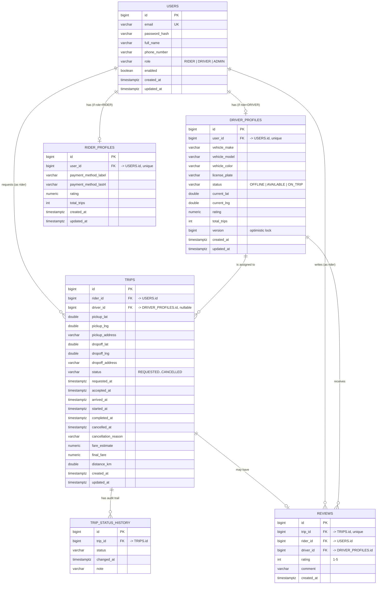

# DispatchHub — Entity-Relationship Diagram

This mirrors the JPA entities in `backend/src/main/java/com/credx/dispatchhub/entity`
and the tables created in `docs/DATABASE-SCHEMA.sql`.

## Notes on modeling decisions

- **`Trip.rider` references `User`, not `RiderProfile`.** Any user with role
  `RIDER` can request a trip directly; `RiderProfile` exists to hold
  rider-specific extras (payment stub, aggregate rating) rather than being a
  required join for every trip query.
- **`Trip.driver` references `DriverProfile`, not `User`.** Drivers always
  have exactly one `DriverProfile`, and trip-matching logic (availability,
  vehicle info, current location) all lives on that profile, so it's the more
  natural FK target.
- **`DriverProfile.version`** is a JPA `@Version` column intended for
  optimistic locking on the driver-matching path. It exists in the schema but
  is not currently used to guard the accept-trip flow (see Known Bugs in the
  root README).
- **`TripStatusHistory`** is an explicit audit-trail table (rather than an
  embedded/embeddable list) so history rows can be queried and paginated
  independently of the parent trip if needed later.
- **`Review`** has a unique constraint on `trip_id` — at most one rider
  review per trip.
